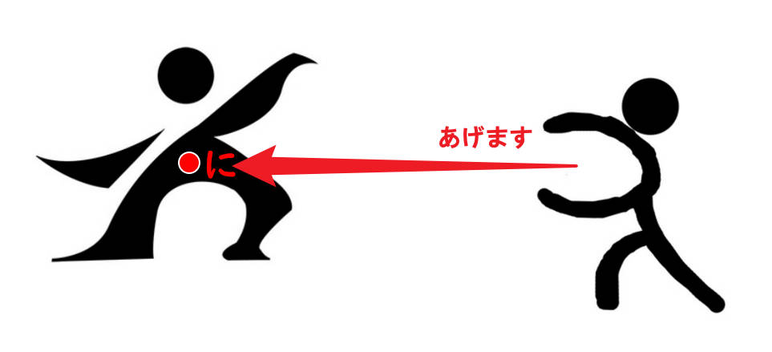
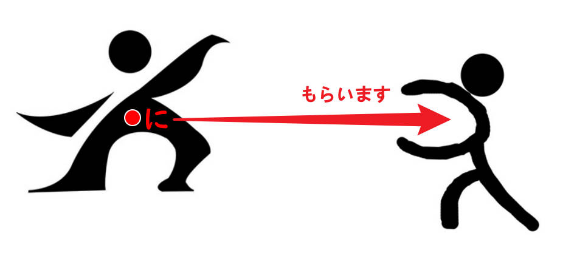

# 助词用法整理

<small>最后更新：《大家的日语》第17课 时间：2023年11月5日 11:50</small>

1. **は**

   - 接在主题名词后面，后面再接有关主题的内容、特征的描述。`第1课`

     > 私**は**学生です。

   - 后面接地点性名词，表示人或物存在于某地。`第3课`

     > 先生**は**教室です。（人）
     >
     > お手洗い**は**あそこです。（物）

   - 宾语主题化，接在「名词を动词」中的直接宾语名词后面，放在句首表示强调。`第17课`

     > 昼ご飯<del>を</del><u>**は**</u>まだ食べていません。
     >
     > 荷物<del>を</del><u>**は**</u>ここに置かないでください。

2. **か**

   - 接在句尾，构成一般疑问句。`第1课`

     > 劉さんは学生です**か****↑**。
     >
     > そうです**か****↑**。＝是吗？（怀疑或惊讶情绪）

   - 接在两个及以上并列疑问句的后面，构成选择疑问句，“～呢？～呢？”。`第2课`

     > これはノートです**か****↑**、本です**か****↑**。

   - 接在句尾，表达对<u>新得知</u>内容的认可。

     > そうです**か****↓**。＝是嘛。`第2课`
     >
     > A：日曜日京都へ行きました。
     >
     > B：京都です**か****↓**。いいですね。`第6课`
     
   - 在句中接在疑问词后面，不表示疑问，表达“不确定”。`第13课`

     > 喉が渇きましたから、何**か**[を]飲みたいです。
     >
     > 冬休みはどこ**か**[へ]行きましたか。

3. **も**

   - 接在名词后面，“也是”。`第1课`

     > 劉さんは学生です。李さん**も**学生です。
     
   - 接在疑问词后面，表达全面否定，“～都不”、“～也不”。`第5课`

     > どこ<small>[へ]</small>**も**行きません。
     >
     > 何**も**食べません。
     >
     > 誰**も**来ませんでした。

4. **の**

   - 前后连接名词，表示前面的名词修饰后面的名词，“的”。

     - 表达从属所属关系。`第1课` `第2课`

       > ミラーさんはIMC**の**社員です。（所属）

     - 表达内容相关关系。`第2课`

       > これはコンピューター**の**本です。（内容）
       
     - 表达产地厂家关系。`第3课`
     
       > これは日本**の**ワインです。（产地）
       >
       > これはサントリー**の**ウイスキーです。（厂家）

   - 接在名词后面，省略后面的名词。`第2课`

     > あれは誰**の**<u>かばん</u>ですか。劉さん**の**です。
     
   - 接在形容词后面，省略后面的名词。`第12课`

     > A：カリナさんのかばんはどれですか。
     >
     > B：あの赤くて、大きい**の**です。

5. **お**

   - 接头词。后面接名词，表示称呼名词时的郑重语气。`第2课`

     > **お**酒、**お**土産

   - 接头词。后面接名词，表示对对方或第三者的敬意。`第3课`

     > **お**国はどちらですか。

6. **ご**

   - 接头词。后面接名词，表示敬意。`第13课`

     > **ご**注文は？
     >
     > **ご**結婚おめでとうございます。

7. **に**

   - 接在时间性名词后面，构成时间状语。`第4课`

     > ６時半**に**起きます。
     
   - 接在名词后面，表示单向动作<small>（从来,去到）</small>所指向的对象。（授受关系）`第7课`

      

     >木村さん**に**花をあげました。
     >
     >李さん**に**お金を貸しました。
     >
     >劉さん**に**英語を教えます。
     >
     >山田さん**に**花をもらいました。
     >
     >カリナさん**に**本を借りました。
     >
     >先生**に**日本語を習います。
     >
     >友達**に**会います。`第6课·单词`
     
   - 接在地点性名词后面，表示物或人存在的场所，“在～”。`第10课`

     > 机の上**に**本<u>が</u>あります。（桌子上有书。）
     >
     > 本<u>は</u>机の上**に**あります。（书在桌子上。）
     >
     > 受付**に**木村さん<u>が</u>います。（前台有木村。）
     >
     > 木村さん<u>は</u>受付**に**います。（木村在前台。）

   - 接在期间名词后面，后接次数名词，表示做某事的频率频度。`第11课`

     > <u>１か月</u>**に**<u>２回</u>映画を見ます。
     
   - 谓语使用表示移动的动词，接在动词ます形后面，或动作性名词后面，表示移动（去、来、回）的目的（做某事）。`第13课`

     > 神戸へインド料理を食べ**に**行きます。
     >
     > 日本へ美術の勉強**に**来ました。

   - 接在名词后面，表示动作的目的、目的地、结果。`第15课`

     - 主语因某动作的结果，而最终落于（存在于）某名词场所。

       > ここ**に**座ってもいいですか。
       >
       > 京都駅から16番のバス**に**乗ってください。

     - 主语通过某动作，将宾语最终置于某名词场所。

       > ここ**に**車を止めてください。
       >
       > ここ**に**住所を書いてください。

8. **から**

   - 接在时间或地点性名词后面，表示起点，“从～”。`第4课`

     > ９時**から**働きます。
     
   - 接在名词后面，表示单向<small>（从来）</small>动作所指向的对象。（授受关系）`第7课`

     特别当对象不是个人，而是公司、学校等<u>组织</u>时，不要用「に」而要<u>用「から」</u>。

     > 山田さん**から**花をもらいました。
     >
     > 銀行**から**お金を借りました。
     
   - 接在<u>句子</u>后面，表示某事情的起因、原因、理由，“因为～，（所以）～”。（因果关系）`第9课`

     > 今日は子供の誕生日<u>です</u>**から**、早く帰ります。
     >
     > A：毎朝新聞を読みますか。
     >
     > B：いいえ、読みません。時間があり<u>ません</u>**から**。

   - 接在动词て形后面，表示严格顺序的在该动作之后进行的动作。`第16课`

     > この仕事が終わっ<u>て</u>**から**、昼ご飯を食べます。

9. **まで**

   - 接在时间或地点性名词后面，表示终点，“到～”。`第4课`

     > 銀行は３時**まで**です。

10. **までに**

    - 接在时间名词后面，表示期限，“最晚不超过～”、“在～时限之前完成”。`第17课`

      <small>まで是到，に是点，までに就是到～之前的某点，动词一般不可延续，瞬间完成。</small>
      
      > 会議は5時**までに**終わります。
      >
      > 土曜日**までに**本を返さなければなりません。

11. **と**

    - 前后连接名词，表示名词并列（完全列举），“~和~”、“~与~”、“~跟~”、“~同~”。`第4课`

	  > 銀行の休みは土曜日**と**日曜日です。
	
	- 前面连接名词，表示一同行动的伴随对象，“和~”、“与~”、“跟~”、“同~”。`第5课`
	
	  > 家族**と**日本へ来ました。
	  >
	  > <small>**一人で**東京へ行きます。`特例（参考で语法）`</small>
	

11. **ね**

    - 接在句尾，构成希望得到对方认同的感叹，“啊”、“了吧”。`第4课`

      > 大変です**ね**。（希望得到对方认同的感叹）

    - 接在句尾，构成确认等语气，“对吧”、“是吧”。`第4课`

      > 劉さんの電話番号は158の6666の8888です**ね**。（确认）
      
    - 接在句尾，表达对<u>已知晓</u>内容的认可。`第5课`

      > そうです**ね****↓**。＝是啊。
      >
      > A：明日は日曜日ですね。
      >
      > B：あ、そうです**ね****↓**。
      
    - 接在句尾，引出答句，表达对问题的思考，“嗯，……”，“这个问题啊，……”，“让我想想，……”，“Well,……”。`第8课`

      > A：お仕事はどうですか。
      >
      > B：そうです**ね**。忙しいですが、面白いです。

12. **へ**

    - 接在地点性名词后面，表示方向，“往～”、“朝～”、“向～”。

      - 后面接表示移动的动词，表示移动的方向。`第5课`

        > 京都**へ**行きます。
        >
        > 日本**へ**来ました。
        >
        > うち**へ**帰ります。

13. **で**

    - 接在名词后面，表示工具、手段、方法，“用～”、“凭借～”。`第7课`

      > スプーン**で**食べます。
      >
      > 日本語**で**レポートを書きます。
      >
      > A：「Thank you」は日本語**で**何ですか。
      >
      > B：「ありがとう」です。
      
      - 接在交通工具后面，后面接表示移动的动词，表示交通方式。`第5课`
      
        > 電車**で**行きます。
        >
        > タクシー**で**帰りました。
        >
        > <small>駅から**歩いて**帰りました。`特例（参考动词て形）`</small>
      
    - 接在名词后面，表示范围，“在～”。`第12课`

      > A：家族**で**だれがいちばん背が高いですか。
      >
      > B：弟がいちばん背が高いです。

      - 接在地点性名词后面，表示动作发生的场所，“在～（做～）”。`第6课`

        > 駅**で**新聞を買います。

14. **よ**

    - 接在句尾，构成提示、提醒语气，“～哟”、“～呢”、“～啦”。`第5课`

      > この電車は甲子園へ行きません。次の「普通」です**よ**。
      >
      > 北海道に馬がたくさんいます**よ**。
      >
      > マリアさん、このアイスクリーム、おいしいです**よ**。

15. **を**

    - 接在名词后面，表示动作的对象（他动词的宾语）。`第6课`

      > ジュース**を**飲みます。
      >
      > サッカー**を**します。パーティー**を**します。宿題**を**します。

    - 接在地点性名词后面，表示动作的起点、出发点。`第16课`

      > 7時にうち**を**出ます。
      >
      > 梅田で電車**を**降りました。

16. **が**

    - 连接两个<u>句子</u>，表示转折，“虽然\~，（但是）\~”。`第8课`

      > 日本の食べ物はおいしい<u>です</u>**が**、たかい<u>です</u>。
      
    - 接在主语名词后面，强调动作的发出者或后续描述所指的是该主语。`第9课`

      は提示主题，が提示主语。一句话中不能有俩は，强调的部分“が前は后”，根据提问的空缺作答。

      > A：あの方**は**<u>誰</u>ですか。
      >
      > B：あの方**は**<u>社長</u>です。
      >
      > A：<u>誰</u>**が**社長ですか。
      >
      > B：<u>あの方</u>**が**社長です。

      特别的，考虑到日本人的民族文化习惯（极尽含蓄委婉之能事），在表达以下内容时：

      （1）事物的存在、拥有（あります）

      （2）个人的能力、好恶、愿望（上手、下手、好き、嫌い、欲しい）

      （3）对于某事物的理解（わかります）

      应当使用以が提示主语的句式。

      > 私は車**が**あります。
      >
      > 伊藤さんは中国語**が**上手です。
      >
      > 李さんはイタリア料理**が**好きです。
      >
      > 私は日本語**が**わかります。
      
    - 接在主语名词后面，表示作为存在主体的物或人。`第10课`

      > 桜**が**あります。
      >
      > 犬**が**います。

    - 接在主语名词后面，表示客观现象、事物的状态、性质等。`第14课`

      > 雨**が**降っています。
      >
      > ミラーさん**が**いませんね。

    - 接在起铺垫作用的引言（开场白）后面，用于接续表达询问、请求、命令等形式的真正意图。`第14课`

      > すみません**が**、塩を取ってください。
      >
      > 失礼です**が**、お名前は？

      <small style="color:red;">※正确的日语语法中并不认为作为引言的「が」具有转折意味，但老师认为将其理解为具有转折意味，有助于在实际表达中把握日式思维（“耻”文化、不愿轻易打扰别人）之中的“退却”感觉。</small>
      
    - 接在主语名词后面再接形容词，构成描述主题特征的部分。`第16课`

      > 大阪<u>は</u>食べ物**が**美味しいです。（大阪<del>的</del>东西好吃。）
      >
      > マリアさん<u>は</u>髪**が**長いです。（玛丽亚小姐<del>的</del>头发长。）

17. **や**

    - 前后连接名词，表示名词并列（不完全列举），“~呀”。`第10课`

      > 箱の中に手紙**や**写真があります。

      有时会在列举出的最后一个名词之后加上「など（等）」，“~啥的”、“~等等”。

      > 箱の中に手紙**や**写真**など**があります。

18. **ぐらい/くらい**

    - 接在数量词后面，表示大概的数量。`第11课`

      > 学校に先生が30人**ぐらい**います。
      >
      > 15分**ぐらい**かかります。

19. **だけ**

    - 接在数量词或名词后面，表示只有、只是，“只有~”、“仅~”、“只是~”、“就~”。`第11课`

      > パワー電気に外国人の社員が一人**だけ**います。
      >
      > 休みは日曜日**だけ**です。

20. **より**

    - 接在名词后面，表示比较的对象，“比～”、“比起～”。`第12课`

      > この車はあの車**より**大きいです。

