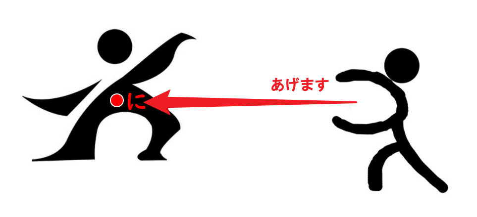
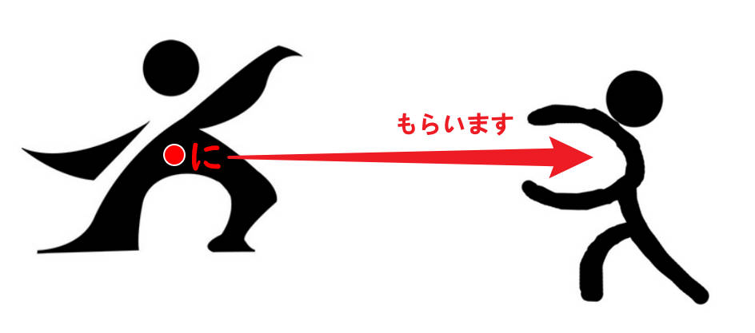

# 助词用法整理

<small>最后更新：《大家的日语》第8课 时间：2023年03月12日 15:45</small>

1. **は**

   - 接在主题名词后面，后面再接有关主题内容的描述。`第1课`

     > 私**は**学生です。

   - 后面接地点性名词，表示人或物存在于某地。`第3课`

     > 先生**は**教室です。（人）
     >
     > お手洗い**は**あそこです。（物）

2. **か**

   - 接在句尾，构成一般疑问句。`第1课`

     > 劉さんは学生です**か****↑**。
     >
     > そうです**か****↑**。＝是吗？（怀疑或惊讶情绪）

   - 接在两个及以上并列疑问句的后面，构成选择疑问句，“～呢？～呢？”。`第2课`

     > これはノートです**か****↑**、本です**か****↑**。

   - 接在句尾，表达对<u>新得知</u>内容的认可。

     > そうです**か****↓**。＝是嘛。`第2课`
     >
     > A：日曜日京都へ行きました。
     >
     > B：京都です**か****↓**。いいですね。`第6课`

3. **も**

   - 接在名词后面，“也是”。`第1课`

     > 劉さんは学生です。李さん**も**学生です。
     
   - 接在疑问词后面，表达全面否定，“～都不”、“～也不”。`第5课`

     > どこ<small>[へ]</small>**も**行きません。
     >
     > 何**も**食べません。
     >
     > 誰**も**来ませんでした。

4. **の**

   - 前后连接名词，表示前面的名词修饰后面的名词，“的”。

     - 表达从属所属关系。`第1课` `第2课`

       > ミラーさんはIMC**の**社員です。（所属）

     - 表达内容相关关系。`第2课`

       > これはコンピューター**の**本です。（内容）
       
     - 表达产地厂家关系。`第3课`
     
       > これは日本**の**ワインです。（产地）
       >
       > これはサントリー**の**ウイスキーです。（厂家）

   - 接在名词后面，省略后面的名词。`第2课`

     > あれは誰**の**<u>かばん</u>ですか。劉さん**の**です。
     >

5. **お**

   - 接头词。后面接名词，表示称呼名词时的郑重语气。`第2课`

     > **お**酒、**お**土産

   - 接头词。后面接名词，表示对对方或第三者的敬意。`第3课`

     > **お**国はどちらですか。

6. **に**

   - 接在时间性名词后面，构成时间状语。`第4课`

     > ６時半**に**起きます。
     
   - 接在名词后面，表示单向动作<small>（从来,去到）</small>所指向的对象。（授受关系）`第7课`

      

     >木村さん**に**花をあげました。
     >
     >李さん**に**お金を貸しました。
     >
     >劉さん**に**英語を教えます。
     >
     >山田さん**に**花をもらいました。
     >
     >カリナさん**に**本を借りました。
     >
     >先生**に**日本語を習います。
     >
     >友達**に**会います。`第6课·单词`

7. **から**

   - 接在时间或地点性名词后面，表示起点，“从～”。`第4课`

     > ９時**から**働きます。
     
   - 接在名词后面，表示单向<small>（从来）</small>动作所指向的对象。（授受关系）`第7课`

     特别当对象不是个人，而是公司、学校等<u>组织</u>时，不要用「に」而要<u>用「から」</u>。

     > 山田さん**から**花をもらいました。
     >
     > 銀行**から**お金を借りました。

8. **まで**

   - 接在时间或地点性名词后面，表示终点，“到～”。`第4课`

     > 銀行は３時**まで**です。

9. **と**

   - 前后连接名词，表示名词并列，“和”、“与”、“跟”、“同”。`第4课`

     > 銀行の休みは土曜日**と**日曜日です。

   - 前面连接名词，表示一同行动的伴随对象，“和”、“与”、“跟”、“同”。`第5课`

     > 家族**と**日本へ来ました。
     >
     > <small>**一人で**東京へ行きます。`特例（参考で）`</small>

10. **ね**

    - 接在句尾，构成希望得到对方认同的感叹，“啊”、“了吧”。`第4课`

      > 大変です**ね**。（希望得到对方认同的感叹）

    - 接在句尾，构成确认等语气，“对吧”、“是吧”。`第4课`

      > 劉さんの電話番号は158の6666の8888です**ね**。（确认）
      
    - 接在句尾，表达对<u>已知晓</u>内容的认可。`第5课`

      > そうです**ね****↓**。＝是啊。
      >
      > A：明日は日曜日ですね。
      >
      > B：あ、そうです**ね****↓**。
      
    - 接在句尾，引出答句，表达对问题的思考，“嗯，……”，“这个问题啊，……”，“让我想想，……”，“Well,……”。`第8课`

      > お仕事はどうですか。
      >
      > そうです**ね**。忙しいですが、面白いです。

11. **へ**

    - 接在地点性名词后面，表示方向，“往～”、“朝～”、“向～”。

      - 后面接表示移动的动词，表示移动的方向。`第5课`

        > 京都**へ**行きます。
        >
        > 日本**へ**来ました。
        >
        > うち**へ**帰ります。

12. **で**

    - 接在名词后面，表示工具、手段、方法，“用～”、“凭借～”。`第7课`

      > スプーン**で**食べます。
      >
      > 日本語**で**レポートを書きます。
      >
      > A：「Thank you」は日本語**で**何ですか。
      >
      > B：「ありがとう」です。
      
      - 接在交通工具后面，后面接表示移动的动词，表示交通方式。`第5课`
      
        > 電車**で**行きます。
        >
        > タクシー**で**帰りました。
        >
        > <small>駅から**歩いて**帰りました。`特例（参考动词て形）`</small>
      
    - 接在地点性名词后面，表示动作发生的场所，“在～（做～）”。`第6课`

      > 駅**で**新聞を買います。

13. **よ**

    - 接在句尾，构成提示、提醒语气，“～哟”、“～呢”、“～啦”。`第5课`

      > この電車は甲子園へ行きません。次の「普通」です**よ**。
      >
      > 北海道に馬がたくさんいます**よ**。
      >
      > マリアさん、このアイスクリーム、おいしいです**よ**。

14. **を**

    - 接在名词后面，表示动作的对象（他动词的宾语）。`第6课`

      > ジュース**を**飲みます。
      >
      > サッカー**を**します。パーティー**を**します。宿題**を**します。

15. **が**

    - 连接两个句子，表示转折，“虽然\~，但是\~”。`第8课`

      > 日本の食べ物はおいしいです**が**、たかいです。
